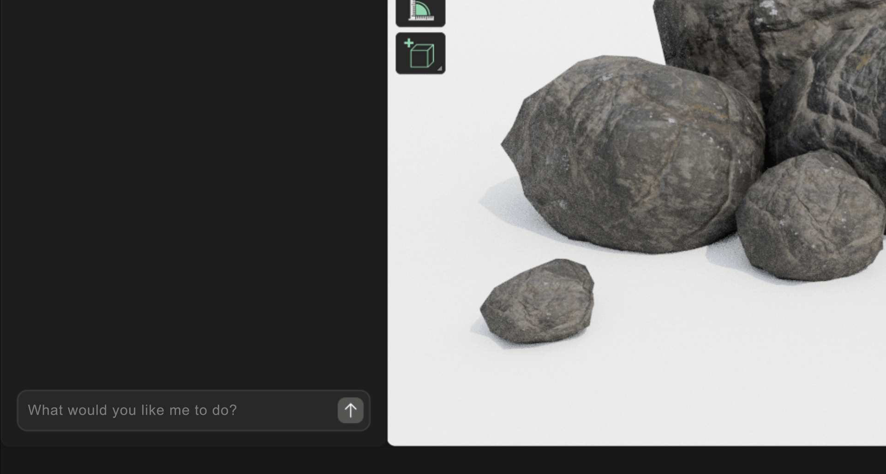

# Vibe4D for Blender

**Ultimate Blender AI Assistant**

## Features

### Blender in natural language

### Get Guides and Help

### Automate Routine Tasks

### Knows your scene

### Customize

## Getting Started

1. **Subscribe to any Vibe4D tier.**
   * You’ll receive the add-on `.zip` file (or download it from [here](dist/vibe4d.zip)) and your personal license key.

2. **Install in Blender:**
   * Go to `Edit > Preferences > Add-ons > Install...`
   * Select the `.zip` you received.

3. **Activate:**
   * Enter your license key in the auth window

> Requires **Blender 4.4** or later

## Contact

* [hi@emalakai.com](mailto:hi@emalakai.com)
* [Twitter](https://x.com/thevibe4d)
* [Discord](https://discord.gg/dXAN23NwkM)
* [Website](https://vibe4d.com)